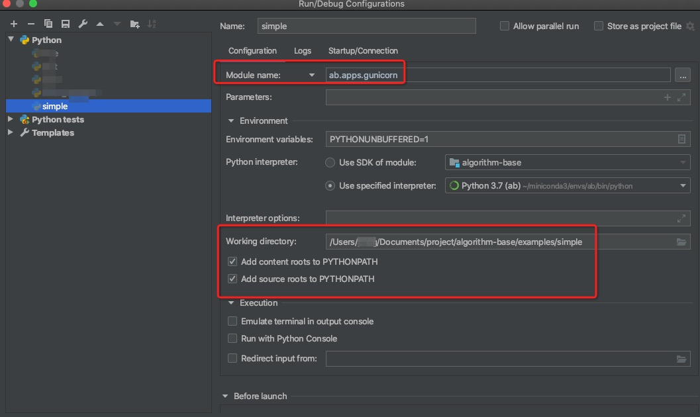

# 最佳实践

## 如何启动服务
在[使用框架的项目](./../../examples/simple)根目录下，执行以下命令便可以启动服务
```
pfs
```

## 如何断点调试ab服务



## 如何修改服务端口
- 在本机调试时，你本机的某些端口可能被占用，故支持修改config内的PORT变量(默认8000)，修改成任意端口进行调试。
- 在发布docker时，gunicorn`必须`使用8000端口，因为最终暴露服务的是docker内置的nginx，而不是gunicorn。
- 生产环境的真实路由情况是：user request -> nginx(80) -> gunicorn(8000)
- nginx的版本是1.14.2

```
docker run -p xxxx:80 your-image 
```

## 如何打包镜像
构建默认的docker镜像,在算法项目的根目录下执行

```
sh build.sh
```

默认使用python3.7版本，如果必须使用其他python版本，请修改DOCKERFILE中的基础镜像.


## 如何启动容器
- 实际项目中，需要自行添加内存，cpu限制
- 宿主机端口需要根据实际情况修改，容器内部端口固定为80

```
docker run -it -v $PWD/logs:/root/app/logs -p 8888:80 --restart=always your-image 
```

## 如何调试问题镜像
- 下面的命令，可以帮助你不启动gunicorn服务，直接进入容器

```
docker run -it --entrypoint bash <your-image> 
```

或

```
docker run -it your-image debug
```


## 测试三部曲
出了问题，先按照如下步骤排查问题

### 第一步：执行测试用例
- 安装并激活具有框架的虚拟环境 
- 比如，在控制台里运行pytest

```
pytest -e dev tests/test_demo.py
```

- 或者使用IDE测试(支持debug)


### 第二步：服务测试
- 先在控制台中，进入项目根目录pfs xxx（xxx为使用的配置环境)启动服务
- 使用curl等方式访问本机服务
curl调用例子

```
curl --location --request POST 'localhost:8000/api/algorithm/add' \
--header 'Content-Type: application/json' \
--data-raw '{
	"args": {"a": 1, "b": 2}
}'
```

Java调用例子

```
OkHttpClient client = new OkHttpClient().newBuilder()
  .build();
MediaType mediaType = MediaType.parse("application/json");
RequestBody body = RequestBody.create(mediaType, "{\n\t\"args\": {\"a\": 1, \"b\": 2}\n}");
Request request = new Request.Builder()
  .url("localhost:2333/api/algorithm/add")
  .method("POST", body)
  .addHeader("Content-Type", "application/json")
  .build();
Response response = client.newCall(request).execute();
```

### 第三步：使用容器测试
- 使用上方"启动容器"先启动容器
- 在容器外部通过`curl`等方式进行测试
